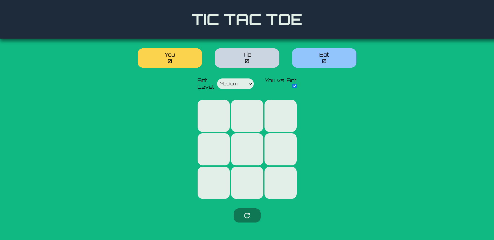

    
    <h1>Tic-Tac-Toe </h1>
    
A webpage to play Tic-Tac-Toe

    

        <a href="https://jotafer19.github.io/tic-tac-toe/" target="_blank" rel="noreferrer noopener">View Demo</a> · 
        <a href="https://github.com/jotafer19/tic-tac-toe/issues" target="_blank" rel="noreferrer noopener">Report Bug</a> ·
        <a href="https://github.com/jotafer19/tic-tac-toe/issues" target="_blank" rel="noreferrer noopener"> Request Feature</a>
    

## Preview

### Features

- A webpage built to play tic-tac-toe.
- You can play against another player or versus the CPU, with various difficulty options.
- Clean UI for better visuals, with indicators for tracking points.

### Built With

-    
-    
- 

### Tools Used

- 
-   
- 

## Usage

- Press the checkbox to change between game modes. Play against other player or the CPU.
- You can see the turn order when playing against other person, or select CPU's difficulty.
- You can choose between play another round or reset the match.

## Outcome

* Used HTML **forms** to take information from the user.
* Used CSS **grid** and **flex** to manage layout.
* Used **JavaScript** with factory functions and module to apply functionality.
* Used **Git** and **GitHub** for project management.
* Tried to maintain **clean code**.

## What I learned

* Better knowledge and it's practical usability of **HTML forms**, **CSS Grid and Flexbox** and the **use of factory functions and module pattern in JavaScript** to organize my code.
* A lot of minor things.

## Acknowledgments

* Inspiration by [**The Odin Project**](https://www.theodinproject.com/lessons/node-path-javascript-tic-tac-toe).